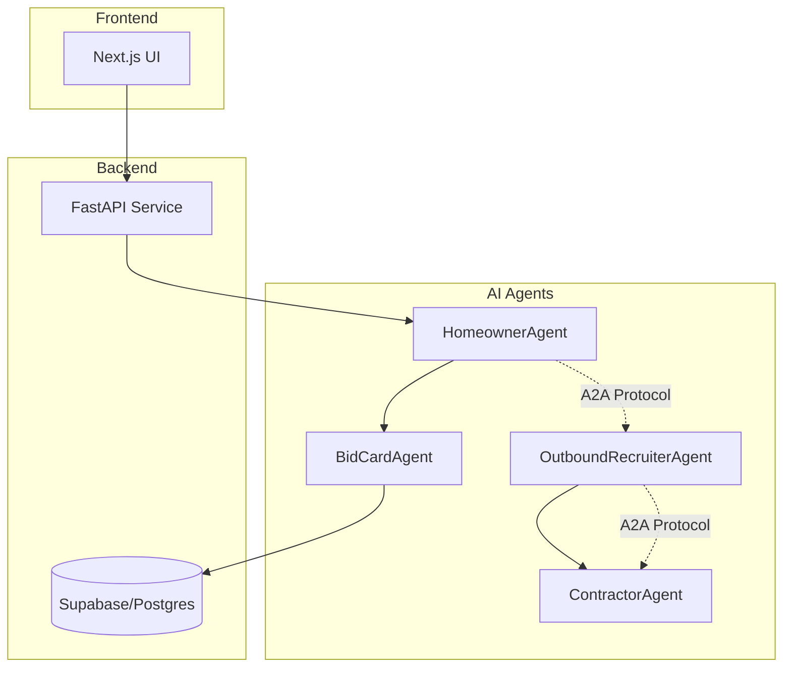

# 🏗️ InstaBids - AI-Driven Multi-Agent Bidding Platform

> **100% AI-Coded Boilerplate for Google ADK 1.0.0+ & Supabase**

[](https://pypi.org/project/google-adk/)
[](https://www.python.org/)
[](https://supabase.com/)
[]()

## 🎯 Project Mission

InstaBids transforms the home improvement bidding process through AI agents that automate project scoping, contractor matching, and bid management. This boilerplate is specifically designed for **100% AI-driven development** where every line of code will be written, maintained, and evolved by AI coding agents.

## 🏛️ Architecture Overview



## 🚀 Quick Start for AI Agents

```bash
# 1. Clone and setup
git clone https://github.com/JustinAIDistuptors/instabids-agentic-boilerplate.git
cd instabids-agentic-boilerplate

# 2. Run environment reset
./scripts/reset_env.sh  # or .ps1 for Windows

# 3. Install dependencies
poetry install --sync

# 4. Setup Supabase
supabase start

# 5. Apply migrations
supabase db reset

# 6. Start development servers
poetry run adk web  # ADK Dev UI on port 8000
poetry run adk api_server  # API server (if needed separately)
```

## 📁 Project Structure

```
instabids-agentic-boilerplate/
├── .adk/
│   └── components.json          # ADK agent registry
├── .prompts/                    # AI instruction repository
│   ├── system/                  # Core agent personas
│   ├── tasks/                   # Reusable task templates
│   ├── conventions/             # Coding standards
│   └── meta/                    # Prompt selection logic
├── docs/                        # AI-consumable documentation
│   ├── README_FOR_AI_CODERS.md
│   ├── COMMON_PITFALLS.md
│   ├── ADK_BEST_PRACTICES.md
│   └── SUPABASE_PATTERNS.md
├── src/
│   └── instabids/
│       ├── agents/              # ADK agent implementations
│       ├── tools/               # Agent tools
│       └── api/                 # FastAPI endpoints
├── db/
│   └── migrations/              # Supabase SQL migrations
├── scripts/
│   ├── reset_env.sh            # Environment cleanup
│   └── reset_env.ps1           # Windows environment cleanup
├── tests/                       # AI-generated test suite
├── pyproject.toml              # Poetry dependencies
└── .env.template               # Environment template
```

## 🤖 AI Agents

### Implemented Agents

1. **HomeownerAgent** - Conducts interactive Q&A to scope projects
2. **BidCardAgent** - Generates structured bid cards with AI confidence scores
3. **PromptSelectorAgent** - Meta-agent that selects appropriate prompts

### In Development

4. **OutboundRecruiterAgent** - Matches projects with contractors
5. **ContractorAgent** - Assists contractors in bid formulation

## 🔧 Technology Stack

- **AI Framework**: Google ADK 1.0.0+ (Python)
- **LLM**: Gemini 2.0 Flash (via `google-genai`)
- **Backend**: FastAPI + Supabase (PostgreSQL + pgvector)
- **Frontend**: Next.js 14 + TypeScript
- **Testing**: Pytest + Cypress
- **CI/CD**: GitHub Actions

## 📚 Documentation for AI Coders

All documentation is written specifically for AI agents:

- `docs/README_FOR_AI_CODERS.md` - High-level guide for AI agents
- `docs/COMMON_PITFALLS.md` - Critical ADK 1.0.0 issues with fixes
- `docs/ADK_BEST_PRACTICES.md` - Project-specific patterns
- `docs/SUPABASE_PATTERNS.md` - Database integration guide

## 🚨 Critical ADK 1.0.0 Reminders

1. **Import Pattern**: Always use `from google import genai` (NOT `import google.generativeai`)
2. **Agent Export**: Export as `agent` (NOT `root_agent`)
3. **Tool Context**: First parameter must be `tool_context: ToolContext`
4. **State Prefixes**: Always use `user:`, `app:`, or `temp:` prefixes
5. **Model ID**: Use `"gemini-2.0-flash-exp"` for live features

## 🧪 Testing

```bash
# Run all tests
poetry run pytest

# Run ADK-specific tests
poetry run adk test

# Run with coverage
poetry run pytest --cov=instabids

# Frontend tests
pnpm test
pnpm run cypress
```

## 🔐 Environment Variables

Copy `.env.template` to `.env` and configure:

```bash
# Supabase
SUPABASE_URL=your-project-url
SUPABASE_ANON_KEY=your-anon-key
SUPABASE_SERVICE_KEY=your-service-key

# Google/OpenAI
GOOGLE_API_KEY=your-google-api-key
OPENAI_API_KEY=your-openai-key  # For vision features

# ADK Settings
GOOGLE_CLOUD_PROJECT=your-project-id
GOOGLE_CLOUD_LOCATION=us-central1
```

## 📊 Database Schema

Core tables managed via migrations:

- `projects` - Home improvement projects
- `bid_cards` - AI-generated project summaries
- `messages` - Chat history
- `user_preferences` - Learned user preferences
- `contractors` - Service provider profiles
- `bids` - Contractor bid submissions

## 🚀 Deployment

```bash
# Validate deployment configuration
gcloud agent-engines deploy --validate-only

# Deploy to Vertex AI Agent Engine
gcloud agent-engines deploy --project=$GOOGLE_CLOUD_PROJECT
```

## 🤝 Contributing

This project is designed for AI agents to contribute code. Human oversight focuses on:

1. Reviewing AI-generated PRs
2. Updating prompts in `.prompts/`
3. Maintaining documentation in `docs/`
4. Managing deployments

## 📝 License

MIT License - See LICENSE file for details

## 🔗 Resources

- [Google ADK Documentation](https://github.com/google/adk-python)
- [Supabase Vector Documentation](https://supabase.com/docs/guides/ai)
- [Vertex AI Agent Engine](https://cloud.google.com/vertex-ai)
- [InstaBids Design Document](docs/ARCHITECTURE.md)

---

**Built with ❤️ by AI for AI** - Every line of code in this project will be written by AI agents following the patterns established in this boilerplate.