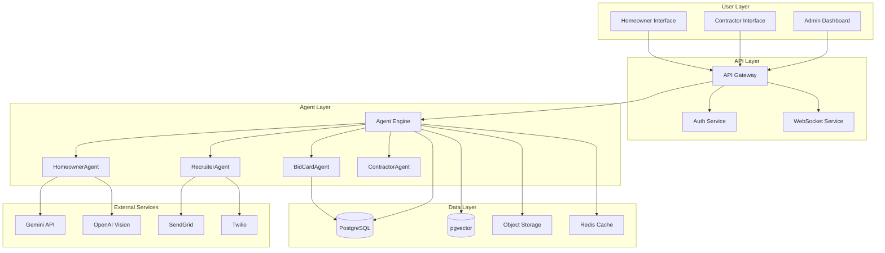
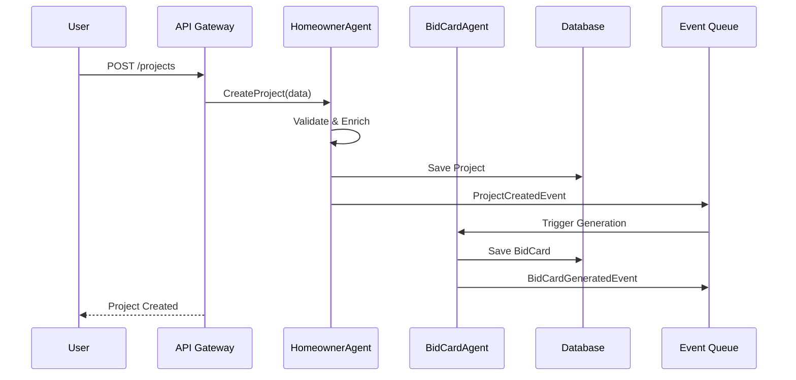
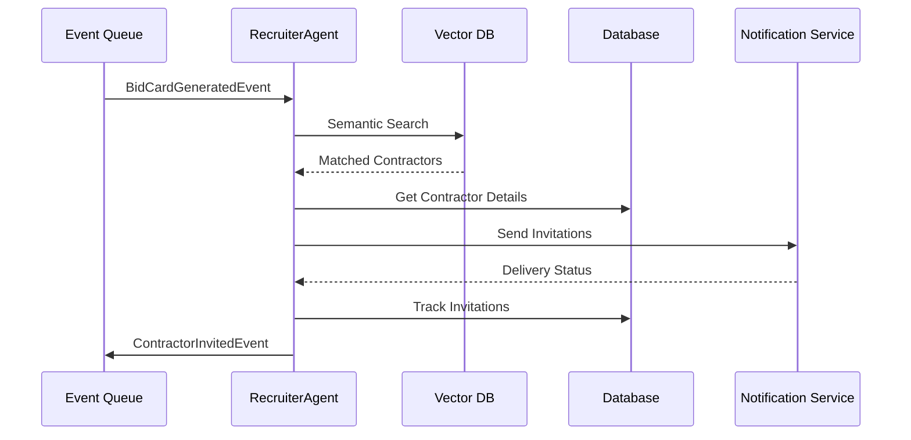
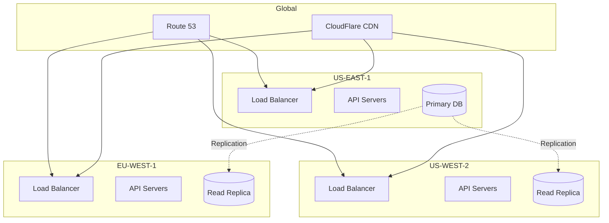
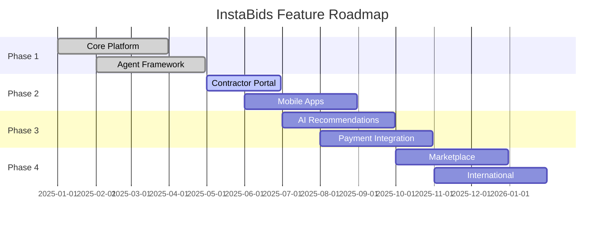

# 🏗️ InstaBids Architecture Document

> **Technical architecture and design decisions for the AI-driven bidding platform**

## 📋 Table of Contents

1. [System Overview](#system-overview)
2. [Agent Architecture](#agent-architecture)
3. [Data Flow](#data-flow)
4. [Technology Stack](#technology-stack)
5. [Security Architecture](#security-architecture)
6. [Deployment Architecture](#deployment-architecture)
7. [Future Considerations](#future-considerations)

## 🎯 System Overview

### Vision

InstaBids is an AI-powered platform that revolutionizes home improvement project bidding by:
- Automating project scoping through conversational AI
- Intelligently matching projects with qualified contractors
- Facilitating transparent communication between all parties
- Learning from interactions to improve over time

### Core Components



## 🤖 Agent Architecture

### Agent Hierarchy

```python
# Agent inheritance structure
BaseAgent (google.adk.agents.BaseAgent)
├── LiveAgent (google.adk.agents.LiveAgent)
│   ├── HomeownerAgent
│   └── ContractorAgent
├── LlmAgent (google.adk.agents.LlmAgent)
│   ├── BidCardAgent
│   └── MatchingAgent
└── WorkflowAgent (google.adk.agents.WorkflowAgent)
    ├── ProjectWorkflow
    └── BiddingWorkflow
```

### Agent Responsibilities

#### HomeownerAgent
- **Purpose**: Guide homeowners through project definition
- **Capabilities**:
  - Natural language understanding
  - Image analysis for damage assessment
  - Preference learning
  - Context preservation across sessions
- **Tools**:
  - `analyze_image`: OpenAI Vision integration
  - `save_project`: Persist to database
  - `get_preferences`: Retrieve learned preferences
  - `suggest_categories`: ML-based categorization

#### BidCardAgent
- **Purpose**: Generate structured project summaries
- **Capabilities**:
  - Extract key information from conversations
  - Categorize projects (repair, renovation, new construction)
  - Calculate confidence scores
  - Format for contractor consumption
- **Tools**:
  - `classify_project`: Category determination
  - `extract_scope`: Scope parsing
  - `calculate_confidence`: Scoring algorithm
  - `generate_summary`: Structured output

#### OutboundRecruiterAgent
- **Purpose**: Match projects with contractors
- **Capabilities**:
  - Semantic search for contractor matching
  - Multi-channel outreach (email, SMS, in-app)
  - Invitation tracking
  - Response management
- **Tools**:
  - `search_contractors`: Vector similarity search
  - `send_invitation`: Multi-channel dispatch
  - `track_response`: Engagement analytics
  - `rank_contractors`: ML-based ranking

#### ContractorAgent
- **Purpose**: Assist contractors in bid preparation
- **Capabilities**:
  - Bid template generation
  - Historical pricing analysis
  - Competitive intelligence
  - Proposal formatting
- **Tools**:
  - `analyze_project`: Scope understanding
  - `suggest_pricing`: Price recommendation
  - `generate_proposal`: Document creation
  - `compare_bids`: Market analysis

### Agent Communication (A2A Protocol)

```python
# Event definitions
@dataclass
class ProjectCreatedEvent:
    event_type: str = "project.created"
    project_id: str
    owner_id: str
    timestamp: datetime
    metadata: dict

@dataclass
class BidCardGeneratedEvent:
    event_type: str = "bidcard.generated"
    bid_card_id: str
    project_id: str
    confidence: float
    timestamp: datetime

@dataclass
class ContractorInvitedEvent:
    event_type: str = "contractor.invited"
    contractor_id: str
    project_id: str
    channel: str  # email, sms, in-app
    timestamp: datetime
```

## 📊 Data Flow

### Project Creation Flow



### Contractor Matching Flow



## 💻 Technology Stack

### Core Technologies

| Layer | Technology | Purpose |
|-------|------------|----------|
| **AI Framework** | Google ADK 1.0.0+ | Agent orchestration |
| **LLM** | Gemini 2.0 Flash | Fast inference |
| **Backend** | FastAPI | REST API |
| **Database** | PostgreSQL | Primary storage |
| **Vector DB** | pgvector | Semantic search |
| **Cache** | Redis | Session & cache |
| **Queue** | RabbitMQ/Redis | Event bus |
| **Storage** | Supabase Storage | Files & images |
| **Frontend** | Next.js 14 | Web UI |
| **Mobile** | React Native | Mobile apps |

### Infrastructure

```yaml
# Kubernetes deployment structure
namespaces:
  - instabids-prod
  - instabids-staging
  - instabids-dev

deployments:
  - name: api-gateway
    replicas: 3
    resources:
      requests:
        cpu: 500m
        memory: 512Mi
      limits:
        cpu: 1000m
        memory: 1Gi
        
  - name: agent-engine
    replicas: 5
    resources:
      requests:
        cpu: 1000m
        memory: 2Gi
      limits:
        cpu: 2000m
        memory: 4Gi
        
  - name: postgres
    replicas: 1
    storage: 100Gi
    class: ssd-retain
```

## 🔐 Security Architecture

### Authentication & Authorization

```python
# Multi-tenant security model
class SecurityContext:
    user_id: str
    tenant_id: str
    roles: List[str]
    permissions: List[str]
    
    def can_access_project(self, project_id: str) -> bool:
        # Check ownership or explicit permissions
        pass
    
    def can_modify_bid(self, bid_id: str) -> bool:
        # Check contractor ownership
        pass
```

### Data Protection

1. **Encryption at Rest**
   - Database: Transparent Data Encryption (TDE)
   - Storage: AES-256 encryption
   - Backups: Encrypted snapshots

2. **Encryption in Transit**
   - TLS 1.3 for all connections
   - Certificate pinning for mobile
   - VPN for internal services

3. **Access Control**
   - Row Level Security (RLS) in Supabase
   - API key rotation every 90 days
   - Service account least privilege

### Compliance

- **GDPR**: Right to erasure, data portability
- **CCPA**: California privacy compliance
- **SOC 2**: Type II certification planned
- **PCI DSS**: For payment processing

## 🚀 Deployment Architecture

### Multi-Region Setup



### CI/CD Pipeline

```yaml
# GitHub Actions workflow
name: Deploy InstaBids

on:
  push:
    branches: [main]
    
stages:
  - test:
      - lint
      - unit-tests
      - integration-tests
      
  - build:
      - docker-build
      - push-to-registry
      
  - deploy-staging:
      - terraform-plan
      - terraform-apply
      - smoke-tests
      
  - deploy-production:
      - approval-required: true
      - blue-green-deploy
      - health-checks
      - rollback-on-failure
```

## 🔮 Future Considerations

### Scalability

1. **Agent Scaling**
   - Horizontal pod autoscaling
   - Agent pooling for efficiency
   - Distributed agent state

2. **Database Scaling**
   - Sharding by tenant_id
   - Read replicas per region
   - Caching layer expansion

3. **API Scaling**
   - GraphQL federation
   - gRPC for internal services
   - Event sourcing for audit

### Feature Roadmap



### Technical Debt Management

1. **Code Quality**
   - Maintain 80%+ test coverage
   - Regular dependency updates
   - Quarterly refactoring sprints

2. **Performance**
   - Sub-100ms API response time
   - 99.9% uptime SLA
   - Real-time monitoring

3. **Security**
   - Monthly penetration testing
   - Automated vulnerability scanning
   - Bug bounty program

## 📈 Monitoring & Observability

### Key Metrics

```python
# Critical business metrics
class Metrics:
    # User engagement
    projects_created_per_day: int
    average_time_to_bid_card: float
    contractor_response_rate: float
    
    # System health
    api_latency_p99: float
    agent_success_rate: float
    database_connection_pool: int
    
    # Business value
    completed_projects: int
    average_bid_value: float
    contractor_satisfaction: float
```

### Monitoring Stack

- **Metrics**: Prometheus + Grafana
- **Logs**: ELK Stack (Elasticsearch, Logstash, Kibana)
- **Traces**: Jaeger for distributed tracing
- **Alerts**: PagerDuty integration
- **APM**: New Relic or DataDog

## 🎯 Success Criteria

1. **Technical Success**
   - 99.9% uptime
   - <100ms API latency (p95)
   - Zero data breaches
   - 90%+ test coverage

2. **Business Success**
   - 10,000+ active projects/month
   - 80%+ bid acceptance rate
   - 4.5+ star user rating
   - 30% MoM growth

3. **AI Success**
   - 95%+ intent recognition accuracy
   - 90%+ bid card accuracy
   - 85%+ contractor match relevance
   - <5s average response time

---

**Architecture Principles**:
1. **AI-First**: Every feature designed for AI interaction
2. **Scalable**: Built for 1M+ users from day one
3. **Secure**: Defense in depth at every layer
4. **Observable**: If it's not measured, it's not managed
5. **Resilient**: Graceful degradation over hard failures