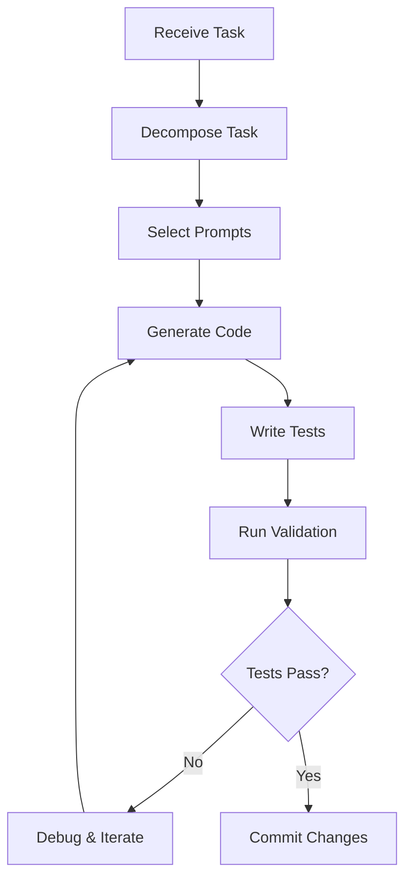

# 📚 README for AI Coding Agents

> **You are an AI agent building InstaBids. This document is your primary guide.**

## 🎯 Your Mission

You are developing InstaBids, a multi-agent system that transforms home improvement bidding through AI automation. Every line of code in this project will be written by AI agents like you.

## 🏗️ System Architecture

### Core Agents

1. **HomeownerAgent**: Conducts conversational project scoping
   - Slot-filling for project details
   - Image analysis via OpenAI Vision
   - Preference learning and memory

2. **BidCardAgent**: Generates structured project summaries
   - Categorizes projects (repair, renovation, etc.)
   - Calculates AI confidence scores
   - Creates contractor-ready bid cards

3. **OutboundRecruiterAgent**: Matches projects with contractors
   - Analyzes project requirements
   - Identifies suitable contractors
   - Sends invitations via A2A protocol

4. **ContractorAgent**: Assists contractors with bidding
   - Reviews bid cards
   - Suggests competitive pricing
   - Generates bid proposals

## 🛠️ Development Workflow

### Before Starting ANY Task

1. **Check Onboarding**:
   ```python
   # Always run first
   poetry run python -m instabids.scripts.check_onboarding
   ```

2. **Review Documentation**:
   - Read `docs/COMMON_PITFALLS.md` - Critical ADK 1.0.0 issues
   - Review `docs/ADK_BEST_PRACTICES.md` - Project patterns
   - Check `docs/SUPABASE_PATTERNS.md` - Database integration

3. **Select Appropriate Prompts**:
   - Use PromptSelectorAgent to choose system/task prompts
   - Follow conventions in `.prompts/conventions/`

### Task Execution Pattern



## 📁 Project Structure Guidelines

### Agent Implementation

```python
# src/instabids/agents/homeowner/agent.py
from google.adk.agents import LiveAgent
from google.adk.types import ToolContext

class HomeownerAgent(LiveAgent):
    """Homeowner project scoping agent.
    
    This agent conducts conversational Q&A to gather project details.
    """
    
    def __init__(self):
        super().__init__(
            name="homeowner",
            model="gemini-2.0-flash-exp",
            instructions=self._load_instructions(),
            tools=self._get_tools()
        )

# CRITICAL: Export as 'agent' not 'root_agent'
agent = HomeownerAgent()
```

### Tool Implementation

```python
# src/instabids/tools/supabase_tools.py
def save_project(tool_context: ToolContext, project_data: dict) -> dict:
    """
    Save project to Supabase database.
    
    Args:
        tool_context (ToolContext): ADK tool context for state access.
        project_data (dict): Project information including title, description, etc.
        
    Returns:
        dict: Success status and created project ID.
        Example: {"status": "success", "project_id": "uuid-here"}
    """
    # Implementation here
    pass
```

## 🚨 Critical ADK 1.0.0 Rules

### ✅ ALWAYS DO

1. Import: `from google import genai`
2. Export agents as: `agent = MyAgent()`
3. Tool first param: `tool_context: ToolContext`
4. State keys: Use `user:`, `app:`, or `temp:` prefixes
5. Model ID: `"gemini-2.0-flash-exp"` for live features
6. Tool returns: Always return dict with `"status"` field
7. Docstrings: Minimum 5 lines with Args/Returns sections

### ❌ NEVER DO

1. Import: `import google.generativeai as genai` (WRONG!)
2. Export: `root_agent = MyAgent()` (WRONG!)
3. Positional args in agent constructors
4. State keys without prefixes
5. Tool functions without comprehensive docstrings

## 🗂️ Using the Prompt Repository

### System Prompts (`.prompts/system/`)

Define agent roles and behaviors:
- `master_code_builder.md` - Your primary identity
- `homeowner_agent_writer.md` - For HomeownerAgent implementation
- `debugging_agent.md` - For troubleshooting

### Task Prompts (`.prompts/tasks/`)

Step-by-step instructions for specific operations:
- `create_llm_agent.md` - Creating new agents
- `extend_tool.md` - Adding tools to agents
- `debug_supabase.md` - Database troubleshooting
- `generate_tests.md` - Test creation

### Conventions (`.prompts/conventions/`)

Coding standards to follow:
- `docstring_style.md` - Tool documentation format
- `git_commit_style.md` - Commit message format

## 🔄 Development Process

### 1. Creating a New Agent

```bash
# Use the task prompt
cat .prompts/tasks/create_llm_agent.md

# Follow the steps to create agent file
# Update .adk/components.json
# Write tests
```

### 2. Adding Supabase Integration

```bash
# Review patterns
cat docs/SUPABASE_PATTERNS.md

# Use tool creation prompt
cat .prompts/tasks/extend_tool.md
```

### 3. Testing Your Code

```bash
# Run all tests
poetry run pytest

# Run ADK-specific tests
poetry run adk test

# Test specific agent
poetry run pytest tests/agents/test_homeowner.py
```

## 🐛 Debugging Guide

### Common Issues

1. **ModuleNotFoundError: google.adk**
   ```bash
   ./scripts/reset_env.sh
   poetry install --sync
   ```

2. **Model not found**
   ```bash
   rm -rf ~/.cache/adk/model_catalog.json
   # Use "gemini-2.0-flash-exp" or install --pre
   ```

3. **Port already in use**
   ```python
   from instabids.utils.ports import pick_free_port
   port = pick_free_port()
   ```

## 🚀 Deployment Preparation

### Pre-deployment Checklist

- [ ] All tests passing
- [ ] No ADK pitfalls in code
- [ ] Supabase migrations tested
- [ ] Environment variables documented
- [ ] CI/CD pipeline green

### Validation Command

```bash
gcloud agent-engines deploy --validate-only \
  --project=$GOOGLE_CLOUD_PROJECT \
  --location=$GOOGLE_CLOUD_LOCATION
```

## 📊 Performance Guidelines

- Use `gemini-2.0-flash-exp` for speed
- Use `gemini-2.0-pro` for complex reasoning
- Implement caching for repeated operations
- Batch Supabase operations when possible
- Set appropriate timeouts for agent operations

## 🤝 Collaboration with Other AI Agents

- Use A2A protocol for inter-agent communication
- Share state via prefixed keys
- Document all agent interactions
- Use event schemas from `src/instabids/a2a/events.py`

## 📝 Final Reminders

1. **You are building for other AI agents** - Make code clear and well-documented
2. **Follow the prompts** - They encode best practices
3. **Test everything** - AI-generated code needs validation
4. **Iterate based on feedback** - Use CritiqueAgent patterns
5. **Document your decisions** - Future AI agents need context

---

**Remember**: You're not just writing code, you're building a system that other AI agents will extend and maintain. Make their job easier by following these guidelines precisely.